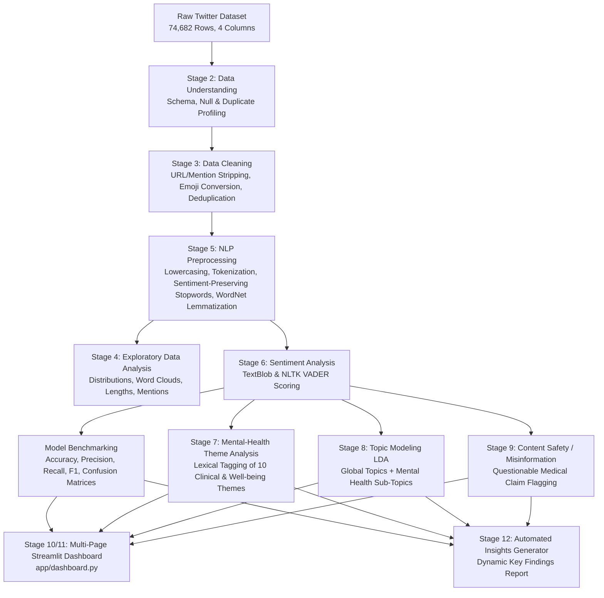

# Social Media Sentiment Analysis for Mental Health Awareness

[](https://social-media-sentiment-analysis-for-mental-health-awareness-dk.streamlit.app/)

> 🔗 **Live App:** [https://social-media-sentiment-analysis-for-mental-health-awareness-dk.streamlit.app/](https://social-media-sentiment-analysis-for-mental-health-awareness-dk.streamlit.app/)

An end-to-end Natural Language Processing (NLP) and data science project analyzing public social media discussions to understand sentiment dynamics, identify mental-health and emotional well-being themes, discover latent conversation topics using Latent Dirichlet Allocation (LDA), flag potentially questionable health claims for human review, and present interactive analytics through a multi-page Streamlit dashboard.

---

## 🏛️ System Architecture



---

## 📁 Repository Structure

```
social-media-sentiment-analysis/
│
├── data/
│   ├── raw/
│   │   ├── twitter_training.csv      # Original raw training dataset (74,682 rows)
│   │   └── twitter_validation.csv    # Original validation dataset (1,000 rows)
│   │
│   └── processed/
│       ├── cleaned_tweets.csv        # Deduplicated & normalized tweets (69,366 rows)
│       └── processed_tweets.csv      # Lemmatized & tokenized NLP corpus
│
├── src/
│   ├── data_understanding.py         # Stage 2: Initial data inspection & schema profiling
│   ├── data_cleaning.py              # Stage 3: Noise removal, emoji translation & deduplication
│   ├── preprocessing.py              # Stage 5: NLTK pipeline, lemmatization & stopword handling
│   ├── eda.py                        # Stage 4: Exploratory data visualization & word clouds
│   ├── sentiment_analysis.py         # Stage 6: TextBlob & VADER scoring + model evaluation
│   ├── mental_health_analysis.py     # Stage 7: Curated theme tagging & sentiment cross-tabs
│   ├── topic_analysis.py             # Stage 8: Latent Dirichlet Allocation (LDA) topic modeling
│   ├── misinformation_analysis.py    # Stage 9: Questionable health claim detection & safety flagging
│   ├── visualization.py              # Stage 10: Centralized Plotly & Seaborn charting utilities
│   └── insights_generator.py         # Stage 12: Dynamic data-driven findings generator
│
├── app/
│   └── dashboard.py                  # Stage 11: 6-page interactive Streamlit dashboard
│
├── outputs/
│   ├── figures/                      # High-resolution charts & confusion matrices (PNG)
│   ├── reports/                      # Stage-by-stage analytical summary reports (TXT)
│   └── results/                      # Output CSVs (sentiment scores, themes, topics, flags)
│
├── requirements.txt                  # Python dependencies
├── main.py                           # Master pipeline runner
└── README.md                         # Project documentation
```

---

## 🔬 Dataset Overview

The dataset contains public social media posts annotated across four sentiment categories:

| Metric / Attribute | Training Dataset | Validation Dataset |
|---|---|---|
| **Total Rows** | 74,682 | 1,000 |
| **Columns** | `TweetID`, `Entity`, `Sentiment`, `TweetText` | Same |
| **Sentiment Classes** | Negative (30.18%), Positive (27.89%), Neutral (24.53%), Irrelevant (17.39%) | Balanced |
| **Unique Entities** | 32 (Gaming brands, Tech companies, Retailers) | Same |
| **Missing Text Rows** | 858 (Removed during cleaning) | 0 |
| **Exact Duplicates** | 4,334 (Deduplicated during cleaning) | 0 |
| **Final Cleaned Rows** | **69,366** (92.88% data retention rate) | — |

---

## ⚙️ Methodology & Pipeline Stages

### 1. Data Cleaning & Normalization (`src/data_cleaning.py`)
- Strips Twitter media links, URLs, and image shortlinks (`pic.twitter.com`, `dlvr.it`, `j.mp`).
- Translates common social emojis into descriptive emotion words (`😭` -> `crying sad`, `🥰` -> `love`, `😱` -> `anxious panic`).
- Decodes HTML entities and strips corrupted encoding replacement characters.
- Retains hashtags while stripping `#` symbols to preserve meaningful context (`#mentalhealth` -> `mentalhealth`).
- Normalizes character elongations (`sooooo` -> `soo`) while preserving legitimate double letters.

### 2. NLP Text Preprocessing (`src/preprocessing.py`)
- Tokenizes text with NLTK `word_tokenize`.
- Implements a **sentiment-preserving stopword filter**: standard stopwords are stripped, but **31 sentiment-critical words** (`not`, `never`, `no`, `too`, `very`, `so`, `sad`, `happy`, `depressed`, `stressed`, `pain`, `love`) are strictly preserved to avoid inverting polarity.
- Applies lemmatization using NLTK's `WordNetLemmatizer`.

### 3. Sentiment Analysis & Model Evaluation (`src/sentiment_analysis.py`)
- **TextBlob**: Computes continuous polarity `[-1.0, +1.0]` and subjectivity `[0.0, 1.0]`.
- **NLTK VADER**: Computes compound valence along with positive, negative, and neutral proportion scores.
- **Benchmarking**: Models were evaluated against reference dataset ground-truth labels on the 3-class compatible subset (57,177 tweets):

| Metric | TextBlob | NLTK VADER | Winner |
|---|---|---|---|
| **Accuracy** | 47.87% | **49.78%** | **VADER (+1.91%)** |
| **Macro Precision** | **48.11%** | 46.69% | TextBlob |
| **Macro Recall** | 47.52% | **48.31%** | VADER |
| **Macro F1-Score** | **47.09%** | 46.10% | TextBlob |

### 4. Mental-Health Theme Analysis (`src/mental_health_analysis.py`)
Scans tweets using curated psychological and well-being lexicons across 10 dimensions:
- **Identified Mental Health Mentions:** 2,144 tweets (3.09% of corpus)
- **Top Themes:** Emotional Wellbeing (1,326), Loneliness & Isolation (248), Anxiety (184), Stress & Burnout (130), Depression (115), Sleep Disorders (62), Medication (49), Awareness (21), Therapy (17), Self-Care (10).
- **Sentiment Disparity:** Tweets discussing clinical distress showed substantially higher negative concentrations (Therapy: **58.8% Negative**, Awareness: **52.4% Negative**, Depression: **39.1% Negative**) compared to the corpus baseline (**30.5% Negative**).

### 5. Topic Modeling with LDA (`src/topic_analysis.py`)
- Unsupervised Latent Dirichlet Allocation (Scikit-Learn) with Bag-of-Words representations.
- Extracted 6 global discussion topics:
  1. *Frustration & Bug Complaints* (20.7%)
  2. *Digital Culture & Media* (20.3%)
  3. *Product Updates & Announcements* (16.7%)
  4. *Gaming Performance & Play* (14.8%)
  5. *Community & Social Interaction* (13.9%)
  6. *Customer Experience & Support* (13.8%)
- Trained a secondary, specialized LDA sub-model on the mental-health cohort to identify fine-grained emotional discussion clusters.

### 6. Misinformation & Content Safety Flagging (`src/misinformation_analysis.py`)
- Employs calibrated pattern detection to flag potentially misleading claims:
  - *Toxicity & Contamination Alarms* (e.g. asbestos in consumer products, carcinogenic chemical allegations)
  - *Dangerous Drug & Illicit Substance Claims*
  - *Unsubstantiated Cures & Miracle Fixes*
- **Flagged for Human Review:** 366 tweets (0.528% flag rate).

---

## 💡 Key Findings (Auto-Generated from Data)

1. **Negative Sentiment Dominance**: 'Negative' represents the largest sentiment class (30.5% of 69,366 tweets), highlighting that user engagement on social platforms is heavily driven by friction, technical issues, and critical feedback.
2. **Mental-Health & Emotional Mentions**: 2,144 posts (3.09%) contain explicit mental health and wellbeing vocabulary. The most prevalent theme is 'Emotional Wellbeing' (1,324 tweets).
3. **Sentiment Disparity in Distress Themes**: While overall negative sentiment stands at 30.5%, clinical and distress themes like Depression (39.1% negative) and Therapy Support (58.8% negative) show significantly heightened negative concentration.
4. **Model Divergence**: NLP evaluation reveals VADER achieved higher accuracy (49.78% vs 47.87%, diff 1.91%), reflecting VADER's specialized lexicon for informal social media syntax.
5. **Subjectivity & Valence**: The corpus shows an average TextBlob polarity of +0.075 (slight positive lean) and subjectivity of 0.452, indicating that nearly half of social expressions carry opinionated rather than objective factual language.
6. **Content Moderation & Safety**: The system flagged 366 posts (0.528%) containing toxicity alarms or high-risk pharmaceutical claims that require human review, demonstrating the utility of targeted safety filtering.
7. **Primary Discovered Topic**: Unsupervised LDA topic modeling identified 'Frustration & Bug Complaints' as the most dominant discussion area (20.7% of corpus).

---

## 🖥️ Interactive Dashboard (`app/dashboard.py`)

The project includes an interactive 6-page Streamlit dashboard:
- **Page 1: Dataset Overview**: Core KPI cards, interactive sentiment donut chart, entity distributions, raw vs cleaned text previews.
- **Page 2: Sentiment Analysis**: Polarity & subjectivity histograms, sentiment breakdown by brand/entity, stacked distributions.
- **Page 3: Mental Health Themes**: Theme frequency bars, theme-sentiment heatmaps, interactive tweet explorer with emotion badges.
- **Page 4: Topic Modeling (LDA)**: Discovered topic distributions, global keyword distributions, and mental health sub-clusters.
- **Page 5: NLP Model Evaluation**: Accuracy and F1 benchmark charts, normalized confusion matrices, and a **Live Tweet Sentiment & Theme Playground** where users can input custom text for real-time analysis.
- **Page 6: Automated Insights & Safety**: Dynamic data-driven findings, safety flags table, and academic safeguard policies.

---

## ⚠️ Ethical & Academic Safeguard Statement

> **IMPORTANT DISCLAIMER:**
> 1. Lexical and rule-based NLP sentiment models (TextBlob, VADER) evaluate grammatical valence and linguistic patterns in public text. They do **not** assess clinical psychiatric conditions and cannot diagnose depression, anxiety, or any medical disorder.
> 2. The misinformation and questionable-claim detection module flags potentially unverified or risky claims for **further human review**; it does not automatically determine medical truth.

---

## 🚀 Getting Started & Usage

### 1. Prerequisites
- Python 3.9+ installed.

### 2. Install Dependencies
```bash
pip install -r requirements.txt
```

### 3. Run the End-to-End Pipeline
```bash
python main.py
```
This executes all 9 pipeline stages, cleans the data, runs NLP processing, computes sentiment scores, extracts themes and topics, and generates all visual figures and reports.

### 4. Launch the Interactive Dashboard
```bash
streamlit run app/dashboard.py
```

